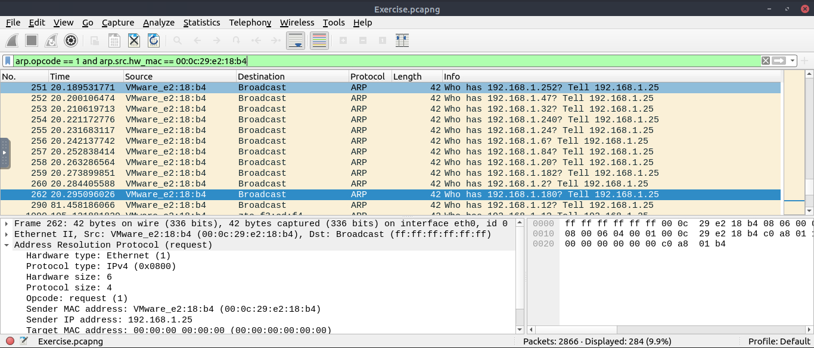

# SOC Incident Report – Wireshark Traffic Analysis

## Overview
This report is based on the **Wireshark Traffic Analysis** room from TryHackMe.  
The goal was to investigate `.pcap` files using Wireshark to detect network anomalies and malicious activity by applying filters and traffic reconstruction.

---

## Task 1 – Nmap Scans
- **Objective**: Identify scan patterns in pcap files.
- **Findings**:
  - **TCP Connect scans**: 1000 detected
  - **Scan type on port 80**: TCP Connect
  - **UDP port unreachable messages**: 1083
  - **Open UDP port between 55–70**: Port 68

 

---

## Task 2 – ARP Poisoning & MITM
- **Objective**: Find the attacker’s ARP requests and sniffed HTTP traffic.
- **Findings**:
  - **ARP requests by attacker**: 284
  - **HTTP packets received by attacker**: 90
  - **Credentials sniffed**: 6
  - **Password for “Client986”**: clientnothere!
  - **Comment from “Client354”**: Nice work!

---

## Task 3 – DHCP, NetBIOS & Kerberos
- **Objective**: Identify hosts and map specific network requests.
- **Findings**:
  - **MAC of “Galaxy A30”**: 9a:81:41:cb:96:6c
  - **NetBIOS registration attempts by “LIVALJM”**: 16
  - **Host requesting IP “172.16.13.85”**: Galaxy-A12
  - **IP of user “u5” in Kerberos**: 10[.]1[.]12[.]2 
  - **Kerberos hostname**: xp1$

---

## Task 4 – DNS & ICMP Tunneling
- **Objective**: Reveal unusual DNS or ICMP tunneling behavior.
- **Findings**:
  - **ICMP tunneling protocol**: SSH
  - **Suspicious domain with long DNS queries**: dataexfil[.]com

---

## Task 5 – FTP 
- **Objective**: Detect credentials and file activity over FTP.
- **Findings**:
  - **Failed login attempts**: 737
  - **Size of file accessed by ftp user**: 39424 bytes
  - **File downloaded by adversary**: resume.doc
  - **Command used to change permissions**: CHMOD 777

---

## Task 6 – HTTP 
- **Objective**: Analyze HTTP traffic for anomalies and recognize Log4j attempts.
- **Findings**:
  - **Anomalous user-agent types**: 6
  - **Packet number with subtle spelling diff in user-agent**: 52
  - **Packet number marking start of Log4j attack**: 444
  - **Attacker IP contacted**: 62[.]210[.]130[.]250

---

## Task 7 – HTTPS 
- **Objective**: Decrypt TLS and inspect HTTP traffic.
- **Findings**:
  - **“Client Hello” frame number**: 16
  - **Number of HTTP2 packets**: 115
  - **HTTP2 Authority header**: safebrowsing[.]googleapis[.]com
  - **Flag found in decrypted data**: FLAG{THM-PACKETMASTER}

---

## Task 8 – Bonus Exercises
- **Cleartext credentials (HTTP Basic Auth)**:
  - **Packet with credentials**: 237  
  - **Packet with empty password**: 170
  - **Deny source IP**: add deny ip from 10.121.70.151 to any in
  - **Allow destination MAC**: add allow MAC 00:d0:59:aa:af:80 any in

---

## Summary
This activity demonstrated effective use of Wireshark to uncover scanning patterns, ARP spoofing, Man In The Middle attack, credential exposure, DNS anomalies, Log4j exploitation, encrypted traffic inspection, and even firewall rule extraction.  

Wireshark proves to be a key tool for thorough traffic-level incident response.

---

**Made by: Xavier Mota**

**22/08/2025**
